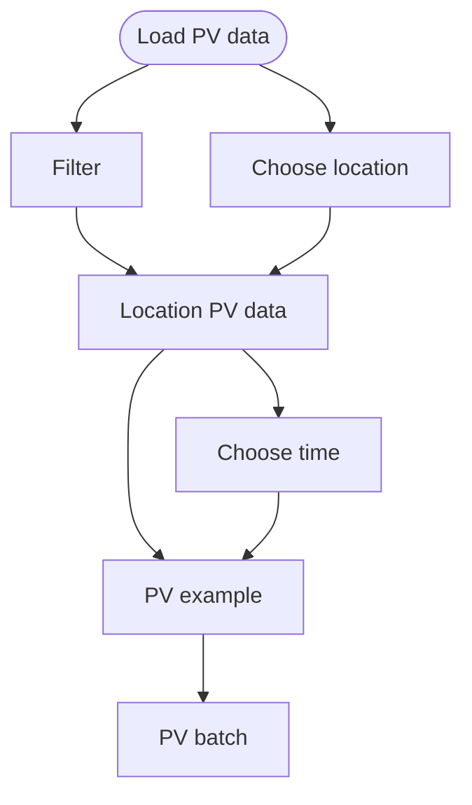
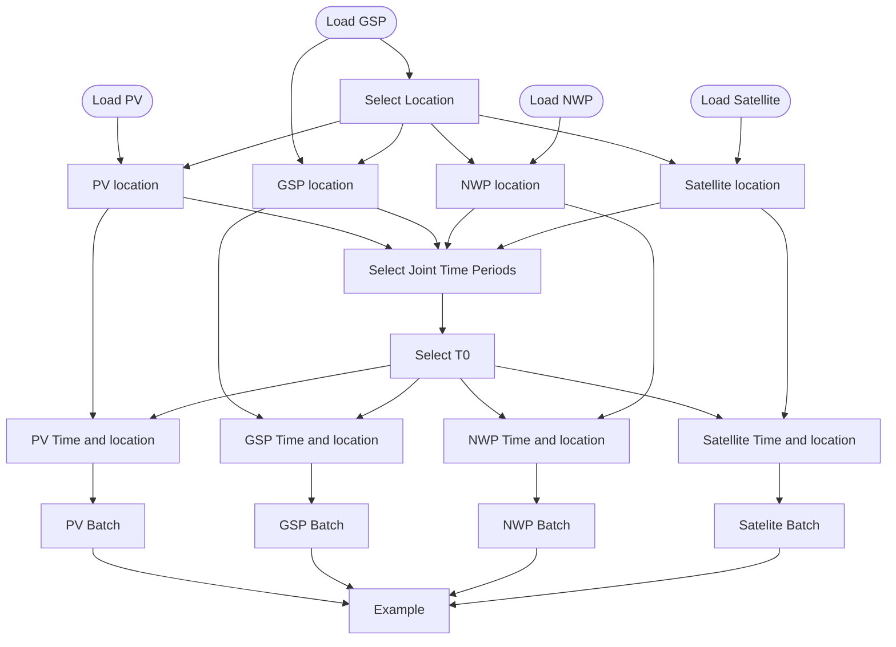
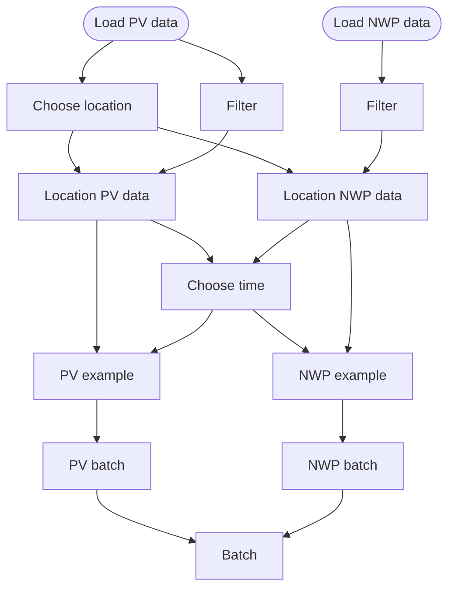
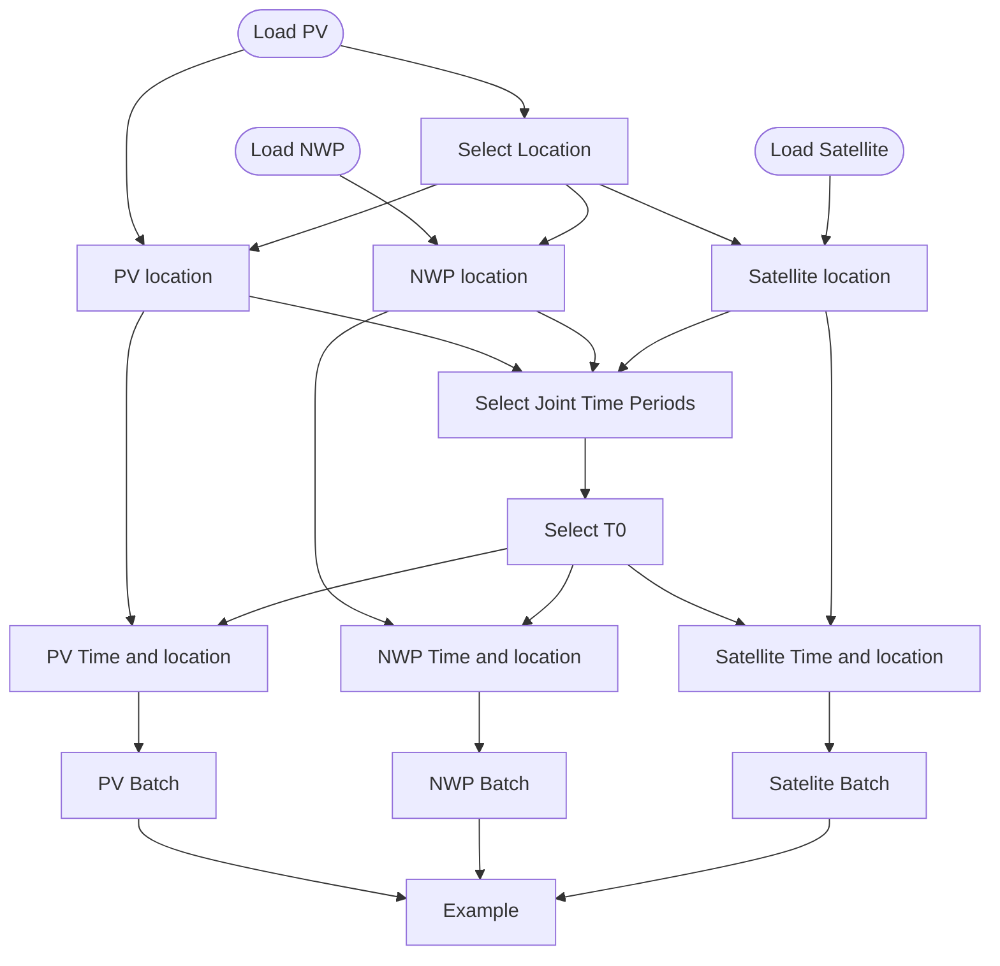

# Example training datapipes

These are example datapipes using the `ocf_datapipes` library

## Simple PV

`simple_pv.py` has a training pipeline for just loading PV data.

The location is chosen using the PV data, PV location data is made.
Then a time is chosen, and PV examples are made.
These examples are then made into batches.

## GSP, PV, Satellite, and NWP Pipeline

`gsp_pv_satellite_nwp.py` is a training pipeline for loading GSP, PV, and Satellite and NWP.

The location is chosen using the center of the GSP location and using GSP timestamps for forecast
time t0. Then a time is chosen, and PV, Satellite and NWP examples are made.

## PVn and NWP Pipeline

`pv_nwp.py` is a training pipeline for loading NWP and PV data.

The location is chosen using the PV data, PV and NWP location data is made.
Then a time is chosen, and PV and NWP examples are made.
These examples are then made into batches and put together into one Batch.

## PV, Satellite and NWP Pipeline

`pv_satellite_nwp.py` is a training pipeline for loading NWP,PV, and Satellite.

The location is chosen using the center of the GSP location.
Then a time is chosen, and PV, Satellite and NWP examples are made.

