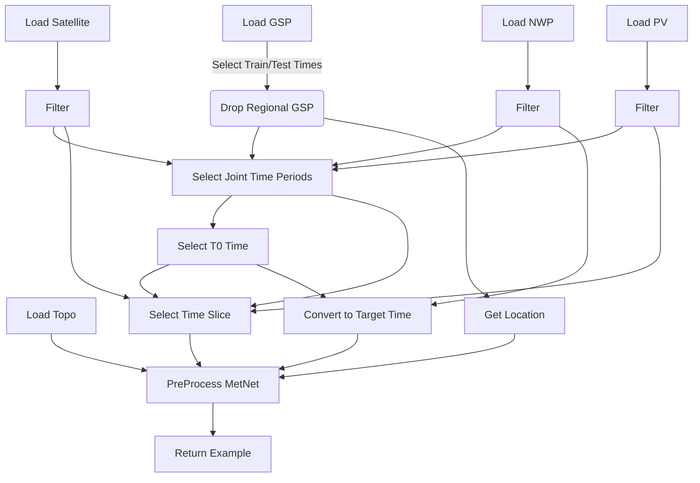

# MetNet National Pipeline

metnet_national.py is a training pipeline for loading NWP,PV,Satellite,and Topographic data and transforming it as in the MetNet paper.

The location is chosen using the center of the National GSP shape. Only the modalities wanted are loaded.
Then a time is chosen, and PV and NWP examples are made.

