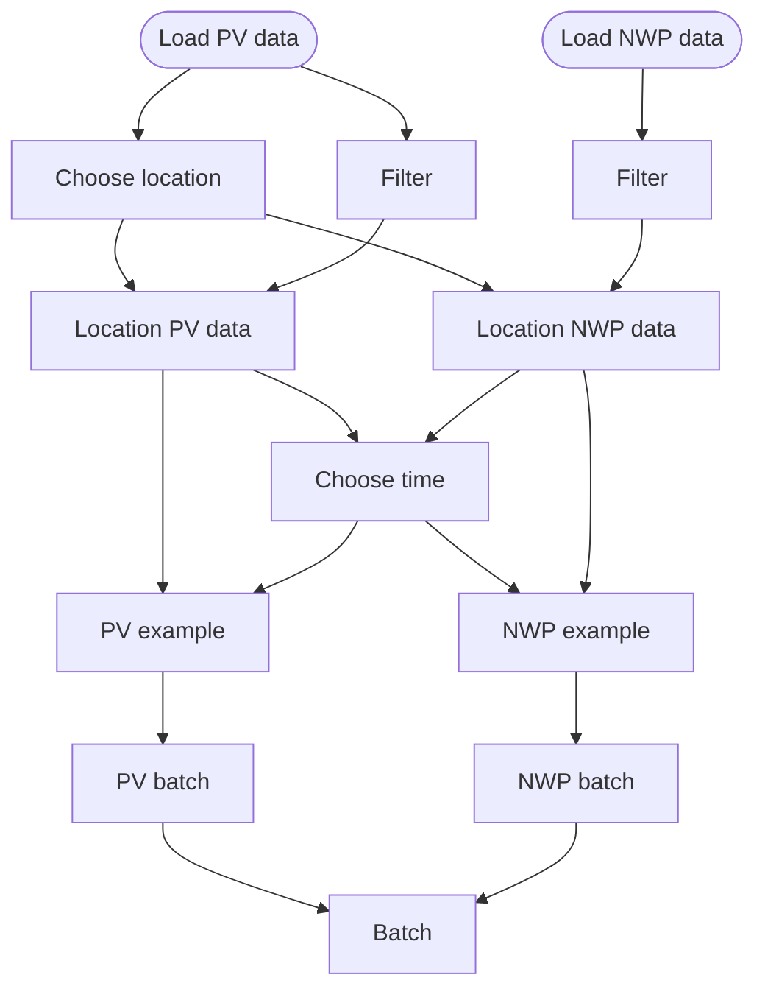

# NWP PV

nwp_pv.py is a training pipeline for loading NWP and PV data.

The location is chosen using the PV data, PV and NWP location data is made.
Then a time is chosen, and PV and NWP examples are made.
These examples are then made into batches and put together into one Batch.

