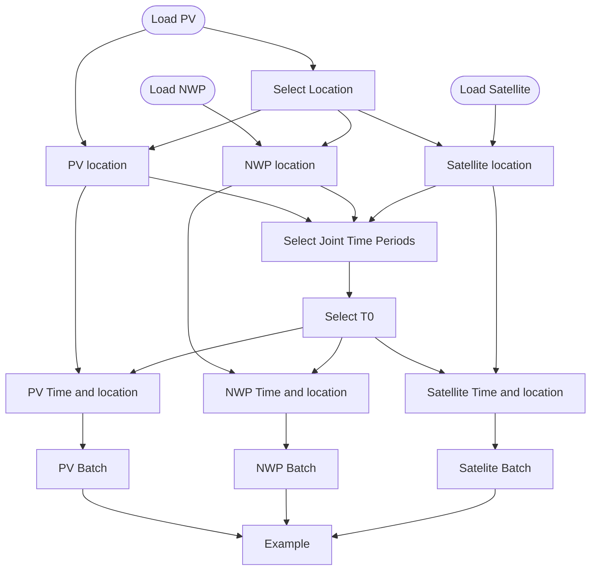

# GSP PV Satellite and NWP Pipeline

gsp_pv_satellite_nwp.py is a training pipeline for loading NWP,PV, and Satellite.

The location is chosen using the center of the GSP location.
Then a time is chosen, and PV, Satellite and NWP examples are made.

