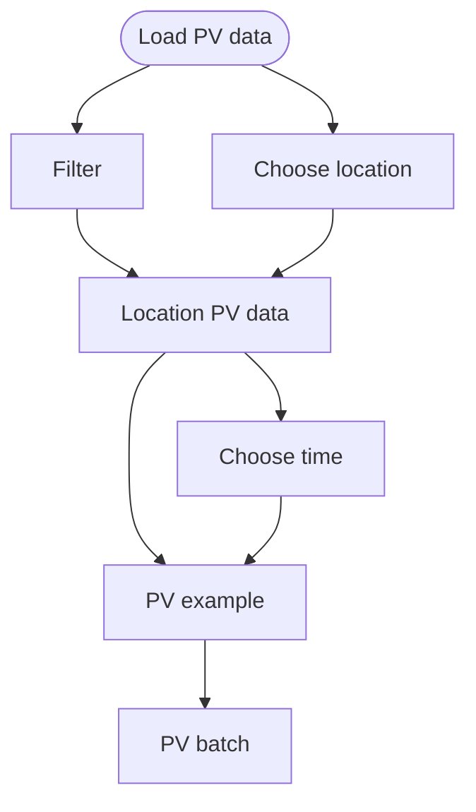

# Simple PV

simple_pv.py has a training pipeline for just loading PV data.

The location is chosen using the PV data, PV location data is made.
Then a time is chosen, and PV examples are made.
These examples are then made into batches.

